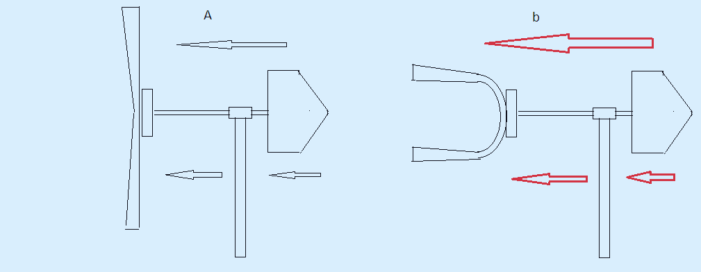

н

# 🌬️ offgrid-open-micro-wind **A Fully Open-Source, Non-Articulated Micro-Wind Turbine (10–50 Watt) Engineered with a Downwind Aeroelastic Coning Matrix, Air-Core Axial Flywheel, and Intelligent Anti-Yaw Active Positioning.** --- ## 🎯 1. Engineering Manifesto & System Architecture This project delivers a completely open-source hardware blueprint for a high-survivability, micro-scale wind harvesting node optimized for off-grid homesteads, eco-villages, and decentralized energy setups. Designed to be fabricated entirely on a standard domestic workbench using accessible raw materials, the system discards standard high-wear components (mechanical furling tails, iron-core stator blocks, sliding brush slip-rings, and complex rotating hub hinges) in favor of elegant applied physics and smart edge automation. ### 📐 Core Technical Matrix: * **The Infinite-Impedance Air-Core Stator (Zero Cogging):** The primary generator features a wide-diameter, ironless axial-flux architecture. Because the stator coils are encapsulated strictly inside a non-magnetic polymer matrix with zero iron cores, **magnetic cogging (sticking) is completely eradicated**. The 1.8-meter rotor starts spinning at fluid boundary currents as low as $1.5\text{ m/s}$, capturing energy fractions that commercial turbines ignore. * **The High-Inertia Kinetic Flywheel:** The generator features a single, heavy structural steel rotor disc embedded with powerful neodymium magnets ($40 \times 20 \times 10\text{ mm}$ array). This structural mass operates as a highly efficient mechanical flywheel. It dynamically dampens wind gusts and fluid turbulence, utilizing rotational inertia to maintain continuous, laminar wattage generation through momentary wind drops. * **The Bifilary Transformer Stator Winding:** Stator coils are wound utilizing a dual-strand (bifilar) layout. This provides the off-grid battery charger loop with a dynamic 2-speed configuration mapable on-the-fly: - *Series Interconnection:* Doubles voltage output under low-velocity wind vectors ($3–4\text{ m/s}$) to cleanly clear the $12\text{V}$ battery charging threshold. - *Parallel Interconnection:* Drops internal resistance and resistance heating while doubling maximum current amperage output ($A$) during high-velocity wind events ($>5\text{ m/s}$). --- ## 🌪️ 2. Aeroelastic Coning Dynamics & Dual-Stage Storm Mitigation To protect the stator copper from burning under destructive gale-force wind velocities without running heavy, failure-prone electrical short-circuit loops, the turbine uses an integrated mechanical-aerodynamic self-regulating configuration. 

*****

 

🌪️ WIND DIRECTION --->

[ Fore-Section: 60% Counterweight ]
______/
|| <-- Vertical Mast Axis
==============||==============
/||
/ || 
/ || 
[ Aft-Section: 40% Wing / Flexes Forward Into A Protected Cone ]

### ⚖️ 2.1. The 60/40 Asymmetric Mass Equilibrium Layout The turn-head assembly operates on a clean **Downwind (passive trailing)** configuration behind the vertical mast axis, implementing a strict asymmetric weight distribution profile: * **The Fore-Section (60% Total Weight Vector):** Establishes a heavy forward offset by positioning the physical chassis of the heavy steel magnetic flywheel toward the oncoming wind boundary. * **The Aft-Section (40% Total Weight Vector):** Holds the ultra-light flexible wing array trailing passively behind the mast structure. * **The Result:** The forward mechanical counter-lever completely isolates the primary vertical yaw bearings from severe wind-drag overturning loads, stabilizing the system with zero tail-boom oscillations. ### 🍃 2.2. Composite Elastic Leaf-Spring Wing Matrix ($7\text{ m/s}$ Threshold) The 1.8-meter rotor blades are molded from a compliant polymer/fiberglass composite skin embedded with an internal **tapered spring-steel spine (leaf-spring lonjeron)**: * **Aeroelastic Blade Twist:** Up to wind velocities of $7\text{ m/s}$, the internal steel spine holds the blade perfectly within its optimal flat aerodynamic lift profile. When velocities cross the $7\text{ m/s}$ boundary, the massive frontal wind pressure forces the elastic blades to deflect forward into an обтекаемый cone ("closing the umbrella"). * **Dynamic Stall:** Because of the pre-molded helical curvature of the composite shell, linear bending automatically forces an axial **Aeroelastic Twist**. The wingtips shed their effective angle of attack relative to the current vector, dropping physical RPMs and shedding aerodynamic lift safely. ### ⏱️ 2.3. Regenerative PWM Brake Control To assist the mechanical leaf-spring coning mechanism during near-instantaneous high-velocity storm fronts, an inline **Regenerative PWM (Pulse-Width Modulation) Solid-State Brake** triggers on pure self-pumping energy. Utilizing high-frequency switching micro-bursts via an industrial MOSFET array, the system applies a controlled magnetic counter-torque pulse. This drops the high inertia of the flywheel instantly, zeroing the centrifugal forces keeping the blades straight, and allowing the atmospheric wind wall to easily fold the leaf-spring blades forward into the protected storm stinger configuration. ### 🔩 2.4. Emergency Worm-Gear Band Lock (The Absolute Stop Matrix) For absolute safety under extreme hurricane or typhoon events ($>12–15\text{ м/с}$), the platform deploys an un-backdriveable mechanical emergency stop: * A high-torque, low-draw $12\text{V}$ worm-gear motor drives a structural steel tension rod to tighten a flexible high-friction **brake band loop** directly around the perimeter of the primary steel rotor disc. * Because the worm-gear drivetrain features **absolute mechanical self-locking (irreversibility)**, the band remains clamped under massive kinetic hold-down forces even when the actuator motor is completely powered down, protecting the turbine over multi-day storm windows with $0\text{ Watt}$ power consumption. --- ## 🧠 3. Active Edge AI Orientation & Direct Continuous Cabling The platform completely rejects standard mechanical tail-booms and traditional high-maintenance carbon-brush sliding slip-rings, routing energy via a **Zero-Slip Direct Cable Core**: * **Unbroken Power Path:** The 3-phase AC lines travel from the air-core stator down into the homestead storage facility via a singular, thick-gauge unbroken copper cable running straight through the hollow internal center of the vertical mast. Contact resistance, arcing, and oxidation decay are reduced to $0\%$. * **Edge AI Fluid Filtering (Anti-Yaw Integration):** An external solid-state wind telemetry sensor continuously updates an onboard Arduino/microcontroller computing layer. The firmware applies a statistical sliding-average filter over a 10-minute window, mathematically decoupling permanent macro-wind direction shifts from localized high-frequency turbulent cross-gust noise. This completely prevents destructive micro-yaw jittering. * **Active Worm-Drive Alignment:** When a true, permanent wind shift is logged, a secondary worm-drive gearmotor engages to smoothly rotate the entire turn-head to the new optical orientation vector. The irreversible gear teeth lock the turbine heading perfectly without active holding currents. * **The Firmware Anti-Twist Loop:** The control stack logs all absolute cumulative azimuth rotations in local memory. Upon approach to a programmed cable deflection limit (e.g., $\pm 720^\circ$), the AI detects a phase of absolute calm or nocturnal stasis and fires the active alignment motor to rotate the head back to the zero-point axis, dynamically unspooling the internal cable string with zero downtime. --- ## 📜 4. Open-Source Licensing & Hardware Governance This repository is published as a 100% transparent, copyleft hardware asset under the **CERN Open Hardware Licence Version 2 - Strongly Reciprocal (CERN-OHL-S v2)**. Any community variants, customized blade molds, localized homestead deployments, or commercial production forks MUST retain clear attribution to the original framework, remain fully open-source, and be published under the exact same legal criteria. 
*****
markdown

### ⚡ 3. High-Voltage Thin-Wire Stator Winding & Echeloned Storm Protection Matrix To maximize grid efficiency under dominant low-velocity ambient wind vectors ($3–5\text{ m/s}$), the architecture shifts completely away from high-current, low-voltage (12V) configurations. Generating low voltage over a long 50-meter line triggers massive thermal transmission losses ($I^2R$ decay) and demands heavy, expensive copper cables. The system implements a **High-Voltage Low-Current (50V–100V) 3-Phase AC Transmission Topology** optimized for total hardware safety and absolute low-wind sensitivity. #### 📐 3.1. High-Voltage Thin-Wire Electrodynamics * **Coil Structural Profile:** The air-core stator coils are wound utilizing a thin **$0.4–0.5\text{ mm}$ enamel-coated copper wire**, allowing up to **240–300 turns per coil** within the same physical spatial boundary. 

* **The Low-Wind Harvesting Advantage:** Increasing the turn density scales the induction output voltage linearly. The 1.8-meter rotor clears the structural $12\text{V}$ charging threshold at micro-RPMs under gentle $2\text{ m/s}$ currents. * **Transmission Loss Eradication:** At a steady output profile of $50\text{W}$ under a baseline $50\text{V}$ generation rail, the line current drops to a minor **$0.58\text{ Amperes}$ per phase**: $$\text{I}_{\text{phase}} = \frac{50\text{ W}}{\sqrt{3} \times 50\text{ V}} \approx \mathbf{0.58\text{ A}}$$ * **The Long-Distance Umbilical Array:** Delivering a minor 0.58A current over a **50-meter distance** permits the deployment of thin, highly flexible, and cheap $0.75–1.5\text{ mm}^2$ 3-core cables, reducing line transmission power losses to under $1\%$. * **Foolproof Sub-Surface Rectification:** Upon entering the homestead lab basement, the 3-phase AC line hooks into a modular **200V High-Voltage Schottky Diode Bridge Array** (e.g., *MBR20200*). Operating under a high 50V rail, the fixed $0.4\text{V}$ forward voltage drop of the Schottky barrier accounts for a negligible **$0.8\%$ net efficiency loss**, bypassing complex active MOSFET sync-drivers while maintaining close to a **$99.2\%$ rectification efficiency**. The output feeds a high-voltage input buck-boost DC-DC converter to step-down power into a stable $12.6\text{V}$ charging current. #### 🌪️ 3.2. Automated Absolute Stasis Protection Protocol (Zero-Risk Gale Management) Because the configuration utilizes a large-diameter 1.8m wind capture profile paired with a compact, ultra-lightweight air-core generator, the system enforces a zero-risk policy during extreme weather. **The turbine completely rejects harvesting power during heavy gales or storms ($>7–10\text{ m/s}$)**, prioritizing absolute structural isolation: 1. **Phase 1: Passive Elastic Leaf-Spring Coning ($7\text{ m/s}$ Boundary):** Frontal wind wall pressure overcomes the structural yield threshold of the internal spring-steel spines embedded in the composite Downwind blades. The wings smoothly bend forward into a low-drag, self-limiting protective cone ("closing the umbrella"), dropping structural rotational velocity. 2. **Phase 2: Automated 10-Second MOSFET Braking (The 80V Surge Brake):** If an extreme wind blast drives a voltage spike up to **$80\text{ Volts}$** on the high-voltage bus, an automated solid-state MOSFET controller activates on pure self-pumping energy. It opens a high-power switching loop to dump current onto a heavy-duty ballast dump-load resistor. This electromagnetic counter-torque instantly drops the flywheel velocity to a crawl, zeroing internal centrifugal forces and allowing the wind wall to fully collapse the leaf-spring blades forward. 3. **Phase 3: Irreversible Mechanical Lockout:** To protect the stator copper and the dump-load resistor from prolonged thermal degradation, the active MOSFET braking loop is governed by a strict **10-second automation window**. Within this 10-second window, the AI triggers a high-torque $12\text{V}$ worm-gear motor to tighten a flexible steel brake band loop directly around the main steel rotor chassis. 4. **The Safe Stasis State:** The worm-gear drivetrain locks the main rotor down to an absolute **$0\text{ RPM}$ standstill**. Due to the structural irreversibility of the worm-gear assembly, the brake remains mechanically dead-locked over multi-day storm windows with **$0\text{ Watt}$ active power consumption**, allowing the collapsed turbine matrix to wait out hurricanes safely. 
****
